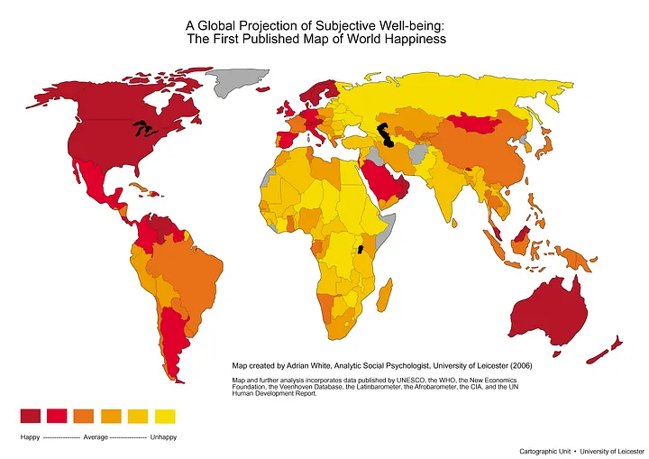

# Analyzing Happiness Around the World

This project analyzes various factors influencing happiness globally, utilizing data from the World Happiness Report.

### Table of Contents

1. [Requirements](#requisites)
2. [Project Motivation](#motivation)
3. [File Descriptions](#files)
4. [Results](#results)
5. [Licensing, Authors, and Acknowledgements](#licensing)

## Requirements 

No additional libraries are necessary beyond the Anaconda distribution of Python. The code is compatible with Python versions 3.*.

## Project Motivation

This project focuses on World Happiness Report data from 2015 and 2016 (with the potential to extend the analysis to later years) to explore the following questions:

What factors contribute to higher happiness levels in countries?
Does the concept of happiness vary across different cultures?
What explains trends in increasing or decreasing happiness over the years?

## File Descriptions 

This repository includes a Jupyter notebook that presents analyses related to the questions above. Additionally, the repository contains datasets corresponding to various years.

## Results

Key findings from the analysis can be found [here](https://medium.com/@vigyaan/what-does-happiness-means-across-the-world-1e5655776279).

In summary:

Countries with greater wealth, strong family support, and better health tend to report higher happiness levels.
In Asia, the Middle East, and Northern Africa, happiness correlates more strongly with family support, while in Central Europe, Latin America, and Sub-Saharan Africa, wealthier countries tend to be happier. In Western nations, perceived generosity is associated with increased happiness.
The analysis revealed consistent results when comparing changes in various factors over time to their absolute values.

## Licensing, Authors, Acknowledgements

The data comes from the World happiness report published each year by the UN Sustainable Development Solutions Network. The surveys resulting in the data are done by Gallup World Poll.  The data can be downloaded at the Kaggle link available [here](https://www.kaggle.com/unsdsn/world-happiness). This project is licensed under the terms of the MIT license.

